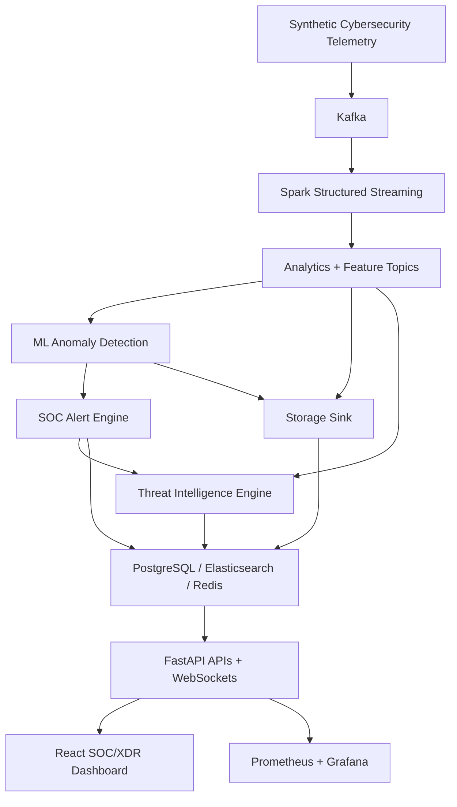

# Real-Time Streaming Analytics AI SOC/XDR Platform

Production-style, fully local AI-powered SOC/XDR platform for real-time cybersecurity telemetry, streaming analytics, ML anomaly detection, alerting, threat intelligence, and enterprise dashboarding.

This project is built as a resume-ready engineering portfolio system. It uses only local/free/open-source infrastructure through Docker Compose.

## Architecture



Detailed architecture: [docs/architecture.md](docs/architecture.md)

## Core Features

- Kafka-based real-time telemetry streaming
- Spark Structured Streaming transformations, window metrics, and feature engineering
- Isolation Forest ML anomaly detection and real-time prediction publishing
- SOC alert engine with deduplication, severity escalation, and incident correlation
- Threat intelligence engine with IOC enrichment, local feeds, MITRE ATT&CK mapping, detection rules, entity profiles, and attack timelines
- PostgreSQL structured persistence, Elasticsearch search, and Redis caching
- FastAPI query APIs, WebSocket streams, OpenAPI docs, security headers, and Prometheus metrics
- React + TypeScript enterprise SOC dashboard with live analytics, alerts, incidents, threat hunting, MITRE, entities, timelines, and observability
- Prometheus + Grafana local monitoring
- Developer startup scripts, health checker, tests, demo guide, and resume summary

## Tech Stack

| Layer | Technologies |
| --- | --- |
| Frontend | React, TypeScript, Vite, Tailwind CSS, Recharts, D3, React Flow, Framer Motion |
| Backend | FastAPI, Pydantic v2, SQLAlchemy, WebSockets |
| Streaming | Apache Kafka, Zookeeper, Python producers/consumers |
| Processing | Apache Spark Structured Streaming, PySpark |
| ML | scikit-learn, pandas, NumPy, joblib, Isolation Forest |
| Security Analytics | Alert rules, incident correlation, IOC enrichment, MITRE ATT&CK, YAML detection rules |
| Storage/Search/Cache | PostgreSQL, Elasticsearch, Redis |
| Observability | Prometheus, Grafana, prometheus-client |
| Infrastructure | Docker Compose, local scripts |

## Screenshots

Add screenshots after starting the stack:

- Overview dashboard
- Alerts and incidents
- Threat intelligence graph
- MITRE ATT&CK matrix
- Observability page
- Grafana dashboard

## Quick Start

Prerequisites:

- Docker Desktop
- Node.js 20+
- Python 3.11+

Laptop-friendly mode:

```powershell
.\scripts\start_light.ps1
```

Unix/macOS/Linux:

```bash
./scripts/start_light.sh
```

Full mode:

```powershell
.\scripts\start_full.ps1
```

Stop everything:

```powershell
.\scripts\stop_all.ps1
```

## Health Check

```bash
python scripts/health_check.py
python scripts/health_check.py --json
```

The checker validates backend, frontend, Kafka, PostgreSQL, Redis, Elasticsearch, Prometheus, Grafana, ML inference, storage sink, alert engine, and threat intelligence metrics.

## Important URLs

| Surface | URL |
| --- | --- |
| React Dashboard | `http://localhost:5173` |
| FastAPI | `http://localhost:8000` |
| OpenAPI Docs | `http://localhost:8000/docs` |
| Kafka UI | `http://localhost:8080` |
| Spark Master UI | `http://localhost:8081` |
| Spark Driver UI | `http://localhost:4040` |
| Elasticsearch | `http://localhost:9200/_cluster/health` |
| Prometheus | `http://localhost:9090` |
| Grafana | `http://localhost:3000` (`admin / admin`) |

## Dashboard Routes

- `/`
- `/live`
- `/risk`
- `/predictions`
- `/alerts`
- `/incidents`
- `/threat-intelligence`
- `/detection-engineering`
- `/threat-hunting`
- `/mitre-attack`
- `/entities`
- `/attack-timeline`
- `/search`
- `/health`
- `/observability`

## API Highlights

- `GET /api/v1/health`
- `GET /api/v1/dashboard/overview`
- `GET /api/v1/alerts/recent`
- `GET /api/v1/incidents/recent`
- `GET /api/v1/threat-intel/overview`
- `GET /api/v1/detections/rules`
- `GET /api/v1/entities/high-risk`
- `GET /api/v1/mitre/tactics`
- `GET /api/v1/monitoring/overview`
- `WS /api/v1/ws/dashboard`
- `WS /api/v1/ws/alerts`
- `WS /api/v1/ws/threat-intel`

## Developer Workflow

Run local verification:

```powershell
.\scripts\verify_all.ps1
```

Manual checks:

```bash
python -m compileall backend/app ml-models/app alert-engine/app storage-sink/app kafka-producers/app threat-intelligence-engine/app
cd frontend && npm run build
docker compose config --quiet
```

Run tests after installing service dependencies:

```bash
pip install -r backend/requirements.txt
pip install -r ml-models/requirements.txt
pip install -r alert-engine/requirements.txt
pip install -r threat-intelligence-engine/requirements.txt
python -m pytest
```

## Repository Layout

```text
backend/                      FastAPI APIs and query services
frontend/                     React TypeScript SOC/XDR dashboard
kafka-producers/              Synthetic telemetry producer and consumer
spark-jobs/                   Spark Structured Streaming pipeline
ml-models/                    ML training and streaming inference
storage-sink/                 Kafka-to-PostgreSQL/Elasticsearch/Redis persistence
alert-engine/                 SOC alerting and incident correlation
threat-intelligence-engine/   IOC enrichment, MITRE mapping, detection rules
detections/rules/             Local YAML detection rules
monitoring/                   Prometheus and Grafana provisioning
scripts/                      Startup, stop, restart, verification, health checks
docs/                         Architecture, demo, phase docs, resume material
```

## Documentation

- [Architecture](docs/architecture.md)
- [Demo Guide](docs/demo-guide.md)
- [Resume Summary](docs/resume-summary.md)
- [Production Readiness Checklist](docs/production-readiness-checklist.md)
- [Troubleshooting Guide](docs/troubleshooting.md)
- [Phase 9 Threat Intelligence](docs/phase-9-threat-intelligence.md)
- [Phase 8 Observability](docs/phase-8-observability-monitoring.md)

## Troubleshooting

If Docker commands fail with a Docker Desktop engine or named pipe error, restart Docker Desktop and retry:

```bash
docker compose config --quiet
docker compose up --build -d
```

If dashboards are empty, let the system run for several minutes so telemetry flows through Kafka, Spark, ML inference, alerting, storage, and threat intelligence.

If Elasticsearch, Prometheus, or Grafana are slow on a laptop, use light mode first:

```bash
./scripts/start_light.sh
```

## Resume Bullet

Built a production-style local AI SOC/XDR streaming analytics platform with Kafka, Spark, FastAPI, React, ML anomaly detection, threat intelligence, alerting, PostgreSQL, Elasticsearch, Redis, Prometheus, and Grafana.

More versions: [docs/resume-summary.md](docs/resume-summary.md)

## Future Improvements

- Authentication and RBAC
- TLS and secret management
- Alembic migrations
- Distributed tracing
- CI/CD with image scanning
- Kubernetes deployment manifests
- Load testing and SLO alerting

## License

MIT License. See [LICENSE](LICENSE).
