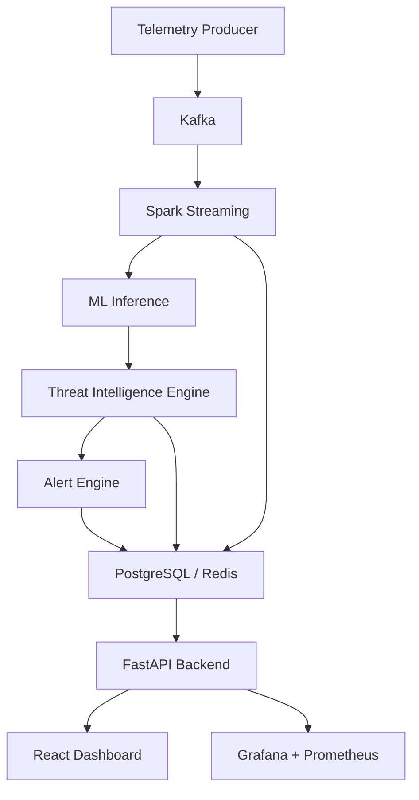
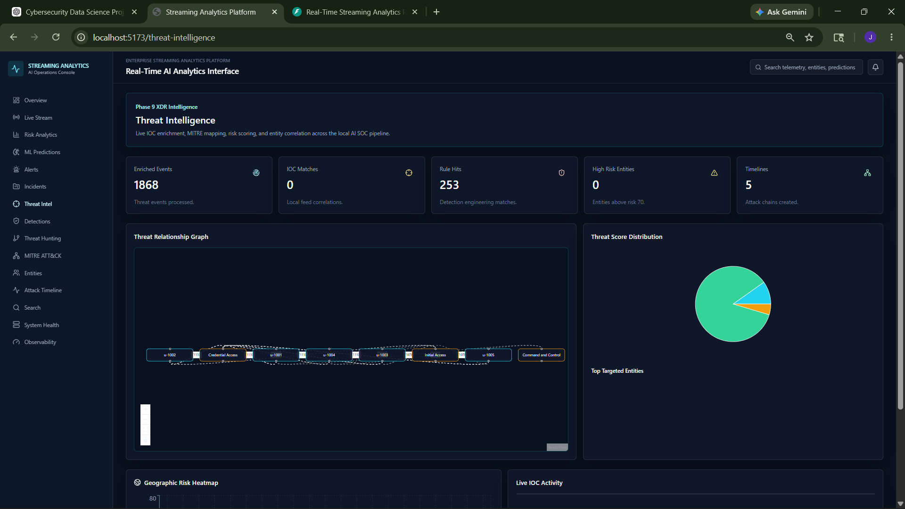

<div align="center">

# Real-Time Streaming Analytics Platform

### AI-powered real-time SOC/XDR analytics platform for streaming telemetry, anomaly detection, threat intelligence, and incident response.


</div>

---

## Project Overview

**Real-Time Streaming Analytics Platform** is a fully local, open-source, production-style AI SOC/XDR system that processes cybersecurity telemetry in real time.

The platform simulates enterprise telemetry, streams it through Kafka, enriches it with Spark Structured Streaming, applies ML-based anomaly detection, correlates incidents, maps detections to MITRE ATT&CK, enriches entities with local threat intelligence, and presents the results through a polished React dashboard and FastAPI APIs.

It is designed to demonstrate practical experience across:

- real-time telemetry processing
- distributed streaming analytics
- AI/ML anomaly detection
- cybersecurity analytics and SOC workflows
- threat intelligence correlation
- observability and platform health monitoring
- Dockerized microservices architecture

Everything runs locally with free/open-source tools. No paid APIs, managed cloud services, or external SaaS dependencies are required.

---

## Key Features

| Capability | Description |
| --- | --- |
| **Real-Time Telemetry Ingestion** | Generates synthetic cybersecurity, login, API, network, and anomaly telemetry. |
| **Kafka Streaming Pipeline** | Uses Kafka topics for telemetry, analytics, ML predictions, alerts, and dead-letter handling. |
| **Spark Streaming Analytics** | Performs structured streaming transformations, aggregations, and feature engineering. |
| **ML Anomaly Detection** | Uses Isolation Forest inference over engineered telemetry features. |
| **Threat Intelligence Engine** | Performs local IOC enrichment, entity profiling, threat scoring, and attack timeline construction. |
| **MITRE ATT&CK Mapping** | Maps detections to tactics, techniques, MITRE IDs, and kill-chain stages. |
| **Detection Engineering** | Supports Sigma-like YAML detection rules and rule hit analytics. |
| **Incident Correlation** | Groups related alerts into incidents with severity escalation and timelines. |
| **Real-Time Alerting** | Streams live SOC alerts and incident updates through FastAPI WebSockets. |
| **Search + Persistence** | Stores structured records in PostgreSQL, indexes searchable data in Elasticsearch, and caches latest values in Redis. |
| **Observability** | Exposes Prometheus metrics and Grafana dashboards for service and pipeline monitoring. |
| **Enterprise Dashboard** | React + TypeScript dashboard for SOC analytics, threat hunting, entities, alerts, incidents, and system health. |
| **Dockerized Microservices** | Runs as a local Docker Compose platform with full and laptop-friendly startup modes. |

---

## Architecture



<details>
<summary><strong>Detailed Data Flow</strong></summary>

1. Synthetic producers emit telemetry into Kafka topics.
2. Spark Structured Streaming consumes telemetry and produces enriched analytics and feature streams.
3. ML inference consumes analytics topics and publishes anomaly predictions.
4. The alert engine evaluates prediction and analytics streams to create SOC alerts and incidents.
5. The threat intelligence engine enriches activity with local IOC feeds, MITRE mappings, rule hits, and entity risk profiles.
6. PostgreSQL, Redis, and Elasticsearch persist structured, cached, and searchable records.
7. FastAPI exposes REST and WebSocket APIs.
8. React visualizes dashboards, alerts, incidents, threat intelligence, MITRE coverage, entities, timelines, and observability.
9. Prometheus and Grafana provide platform health and metrics visibility.

</details>

For deeper diagrams, see [docs/architecture.md](docs/architecture.md).

---

## Tech Stack

### Frontend

| Technology | Purpose |
| --- | --- |
| React | Enterprise dashboard UI |
| TypeScript | Typed frontend development |
| Vite | Frontend build tooling |
| Tailwind CSS | Dark SOC/XDR styling |
| Recharts | Analytics charts |
| D3.js | Graph and data visualization support |
| React Flow | Attack path and relationship graph visualization |
| Framer Motion | UI animation |
| Axios | API client |

### Backend

| Technology | Purpose |
| --- | --- |
| FastAPI | REST APIs, WebSockets, OpenAPI docs |
| Pydantic v2 | API and event schema validation |
| SQLAlchemy | Database ORM |
| Uvicorn | ASGI runtime |
| prometheus-client | Metrics instrumentation |

### Streaming

| Technology | Purpose |
| --- | --- |
| Apache Kafka | Event streaming backbone |
| Zookeeper | Kafka coordination |
| Kafka UI | Local topic inspection |
| Python Kafka clients | Producers, consumers, sink workers |

### AI/ML

| Technology | Purpose |
| --- | --- |
| scikit-learn | Isolation Forest anomaly detection |
| pandas / NumPy | Synthetic training data and feature processing |
| joblib | Model artifact persistence |
| Pydantic | Prediction event contracts |

### Databases

| Technology | Purpose |
| --- | --- |
| PostgreSQL | Structured telemetry, predictions, alerts, incidents, threat intelligence |
| Elasticsearch | Searchable telemetry, alerts, IOC matches, entity profiles |
| Redis | Latest-value cache, counters, deduplication, IOC cache |

### Observability

| Technology | Purpose |
| --- | --- |
| Prometheus | Metrics scraping |
| Grafana | Dashboards |
| Health checker scripts | Local platform validation |

### DevOps

| Technology | Purpose |
| --- | --- |
| Docker Compose | Local microservices orchestration |
| PowerShell / Bash scripts | Startup, shutdown, verification |
| pytest | Backend, ML, alert, and threat-intel test scaffolding |

---

## Dashboard Screenshots

Create a `screenshots/` folder and place images using the filenames below.

### Main Dashboard


### Threat Intelligence Dashboard



### MITRE ATT&CK Dashboard


### Incident Correlation Dashboard


### Real-Time Alerts Dashboard


### FastAPI Swagger Docs


---

## API

The backend is powered by **FastAPI** and exposes production-style REST and WebSocket APIs.

| API Surface | URL |
| --- | --- |
| Backend API | `http://localhost:8000` |
| Swagger Docs | `http://localhost:8000/docs` |
| OpenAPI JSON | `http://localhost:8000/api/v1/openapi.json` |
| Health Check | `http://localhost:8000/api/v1/health` |
| Prometheus Metrics | `http://localhost:8000/metrics` |

Example endpoint groups:

- `/api/v1/dashboard/*`
- `/api/v1/events/*`
- `/api/v1/predictions/*`
- `/api/v1/alerts/*`
- `/api/v1/incidents/*`
- `/api/v1/threat-intel/*`
- `/api/v1/detections/*`
- `/api/v1/entities/*`
- `/api/v1/mitre/*`
- `/api/v1/monitoring/*`
- `/api/v1/ws/dashboard`
- `/api/v1/ws/alerts`
- `/api/v1/ws/threat-intel`

---

## Local Setup

### Prerequisites

- Docker Desktop
- Python 3.11+
- Node.js 20+
- Git

### 1. Clone The Repository

```bash
git clone <your-repository-url>
cd streaming-analytics-system
```

### 2. Environment Setup

The project includes safe example environment files:

```text
.env.example
backend/.env.example
frontend/.env.example
ml-models/.env.example
alert-engine/.env.example
storage-sink/.env.example
threat-intelligence-engine/.env.example
```

Docker Compose uses `.env.example` by default for local development.

### 3. Start Laptop-Friendly Mode

Windows:

```powershell
.\scripts\start_light.ps1
```

Unix/macOS/Linux:

```bash
./scripts/start_light.sh
```

### 4. Start Full Platform

Windows:

```powershell
.\scripts\start_full.ps1
```

Unix/macOS/Linux:

```bash
./scripts/start_full.sh
```

### 5. Verify Health

```bash
python scripts/health_check.py
python scripts/verify_phase_10.py
```

### 6. Stop Services

Windows:

```powershell
.\scripts\stop_all.ps1
```

Unix/macOS/Linux:

```bash
./scripts/stop_all.sh
```

---

## Observability

The platform includes a local monitoring stack:

- Prometheus scrapes backend, ML inference, storage sink, alert engine, telemetry producer/consumer, and threat intelligence metrics.
- Grafana provisions local dashboards for system health, streaming pipeline, ML inference, SOC alerting, and threat intelligence.
- FastAPI exposes monitoring APIs for dashboard integration.
- `scripts/health_check.py` validates core service availability.

Example metrics endpoints:

| Component | Metrics Endpoint |
| --- | --- |
| Backend | `http://localhost:8000/metrics` |
| ML Inference | `http://localhost:9101/metrics` |
| Storage Sink | `http://localhost:9102/metrics` |
| Alert Engine | `http://localhost:9103/metrics` |
| Telemetry Producer | `http://localhost:9104/metrics` |
| Telemetry Consumer | `http://localhost:9105/metrics` |
| Threat Intelligence | `http://localhost:9106/metrics` |

---

## Production Readiness

This project is intentionally built with production-style architecture patterns:

- Dockerized microservices
- modular service boundaries
- typed schemas and event contracts
- Kafka-based streaming pipeline
- Spark-based analytics layer
- independent ML inference service
- independent alert and threat intelligence engines
- PostgreSQL persistence
- Elasticsearch search indexes
- Redis caching and deduplication
- Prometheus metrics
- Grafana dashboards
- FastAPI OpenAPI docs
- WebSocket live updates
- security headers middleware
- health validation scripts
- light and full startup modes

See [docs/production-readiness-checklist.md](docs/production-readiness-checklist.md).

---

---

## License

This project is licensed under the **MIT License**. See [LICENSE](LICENSE).

