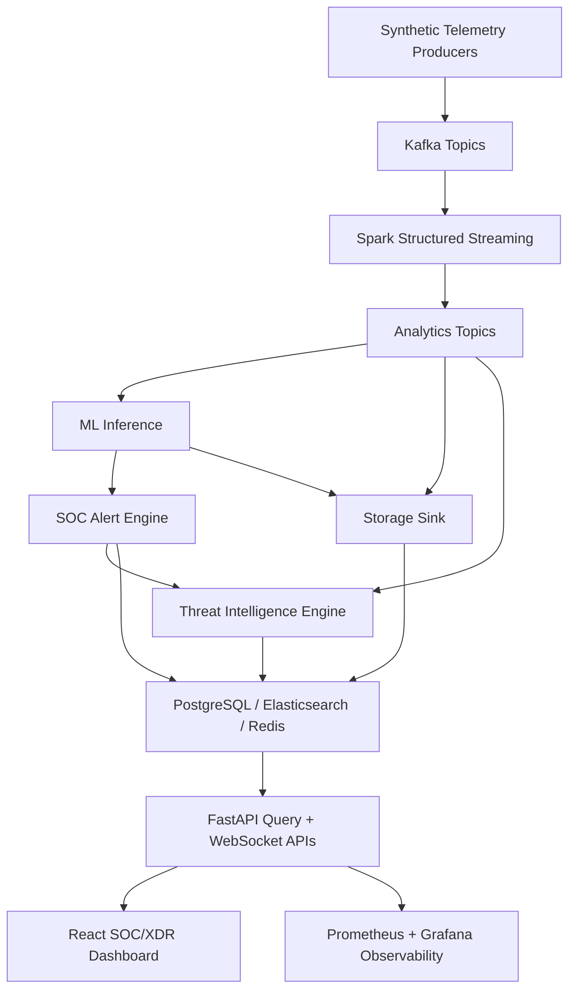
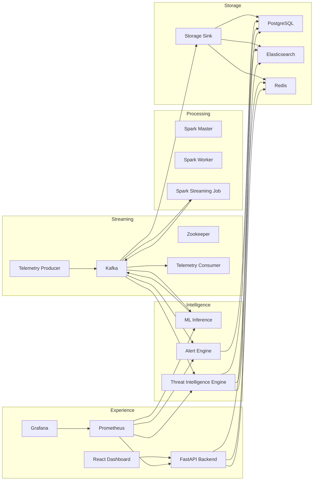
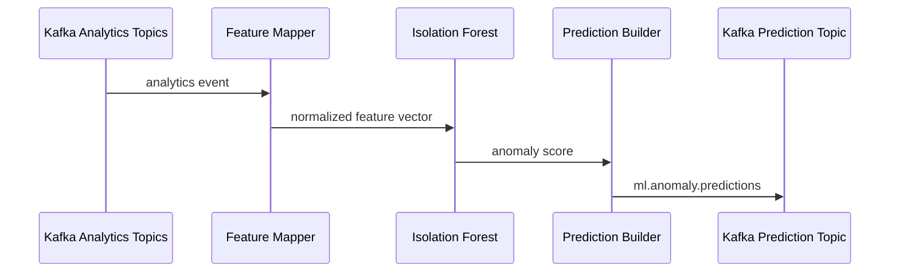
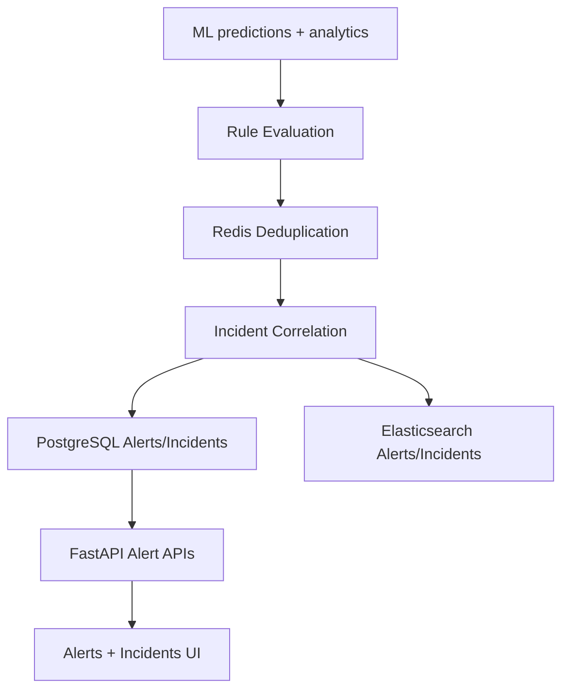
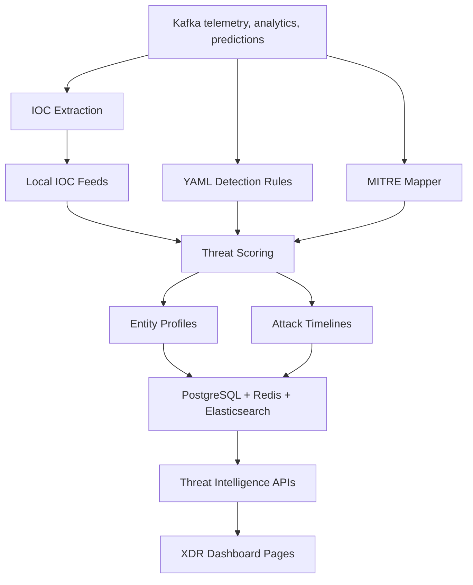
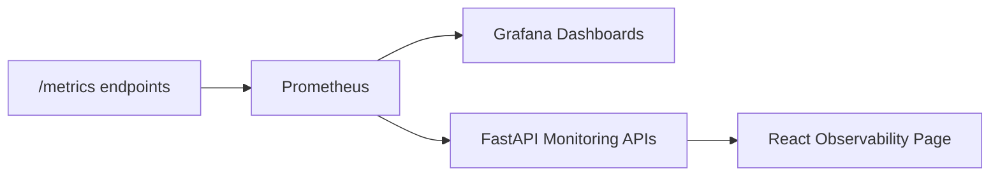
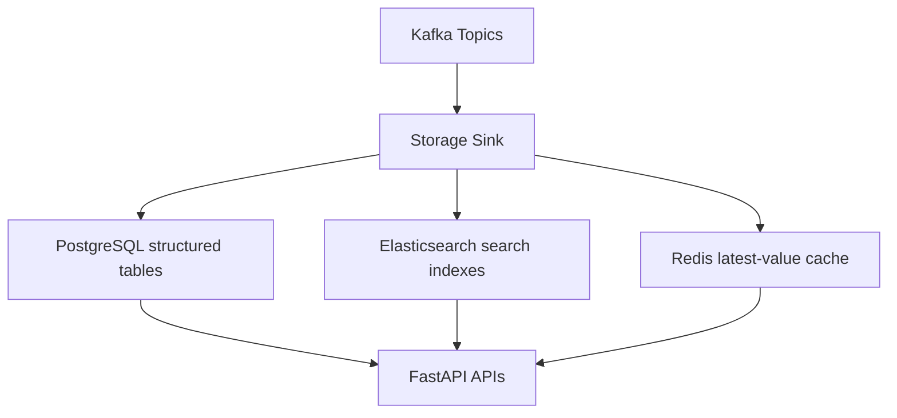

# Architecture

## High-Level Platform

## Service Architecture

## Kafka Topics

| Topic | Purpose |
| --- | --- |
| `telemetry.login.events` | Synthetic login telemetry |
| `telemetry.api.events` | API activity telemetry |
| `telemetry.network.events` | Network traffic telemetry |
| `telemetry.anomaly.events` | Synthetic anomaly telemetry |
| `telemetry.deadletter.events` | Malformed/unprocessable records |
| `analytics.enriched.events` | Spark-normalized enriched events |
| `analytics.window.metrics` | Windowed stream metrics |
| `analytics.risk.metrics` | Aggregated risk metrics |
| `analytics.feature.engineering` | ML-ready feature events |
| `ml.anomaly.predictions` | Real-time ML prediction events |

## ML Inference Flow

## Alert Engine Flow

## Threat Intelligence Flow

## Observability Flow

## Storage Flow

